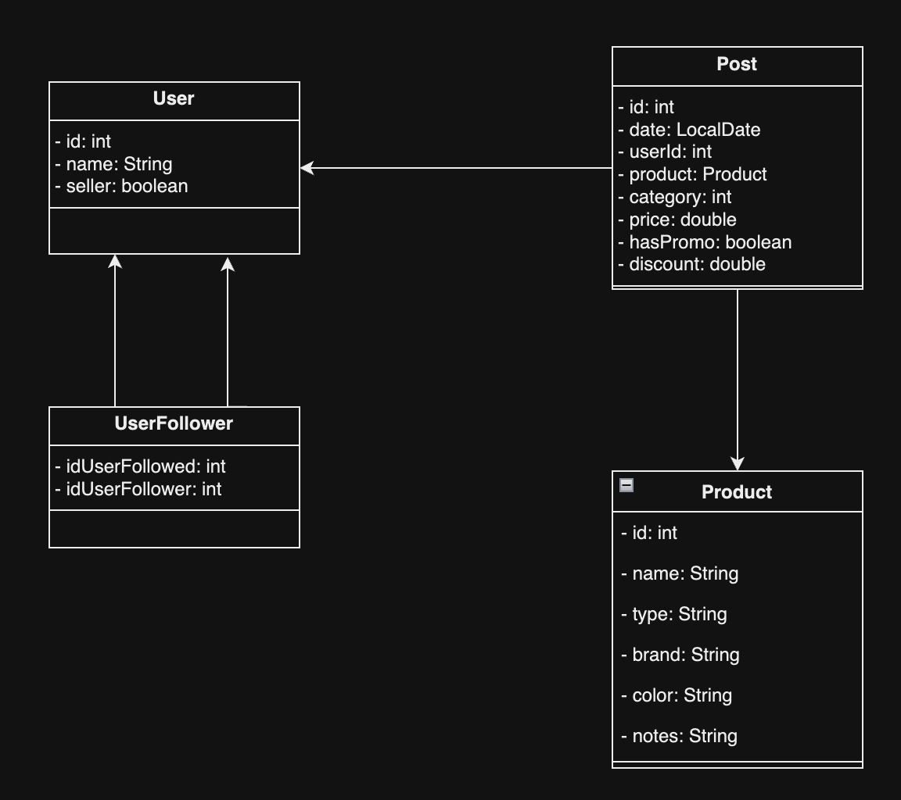
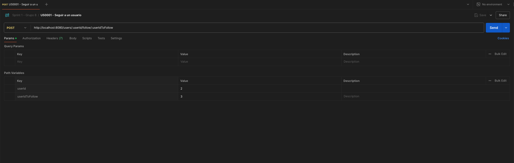
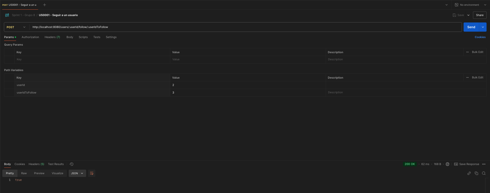

# Documentación de API Rest SocialMeli

## 1. Descripción del problema 📝

Mercado Libre sigue creciendo y para el año que viene tiene como objetivo empezar a implementar una serie de herramientas que permitan a los compradores y vendedores tener una experiencia totalmente innovadora, en donde el lazo que los une sea mucho más cercano. El objetivo de SocialMeli es permitir a los compradores poder seguir a sus vendedores favoritos y enterarse de todas las novedades que los mismos posteen en la plataforma.

## 2. Definiciones de equipo 📚

### 2.1 Diagrama de clases

<center>
    
</center>

### 2.2 Ejecución de la API

Para ejecutar la API, se recomienda seguir los siguientes pasos:

1. Clonar el proyecto con el comando `git clone`
2. Abrir el proyecto en IntelliJ
3. Ejecutar la aplicación con el botón ▶️
4. Verificar la conexión del proyecto en la ruta `http://localhost:8080`

### 2.3 Postman

Para cargar la colección de Postman con todos los endpoints de los requerimientos implementados, se recomiendoa seguir los siguientes pasos:

1. Abrir Postman
2. Importar la colección que se encuentra en la ruta `src/main/resources/postmanCollection-V2.json`
3. Enviar alguna solicitud al aplicativo y revisar su respuesta

### 2.4 Realizar pruebas funcionales a la API

Para realizar las pruebas correspondientes a cada uno de los requerimientos, se debe seleccionar alguno de los endpoints cargados en Postman, definir los datos que serán enviados al servidor, y por último, enviar la solicitud y esperar la respuesta. A continuación se muestra un ejemplo.

1. Seleccionar el endpoint de Postman y definir las variables o el cuerpo de la petición correspondientes.
<center>
    
</center>

2. Realizar el envío de la petición y confirmar que la respuesta dada sea la esperada.
<center>
    
</center>

### 2.5 Enlace a repositorio grupal

https://github.com/albaqueroh/be_java_hisp_w28_g08/tree/develop
https://github.com/users/albaqueroh/projects/1/views/1

## 3. Definición de requerimientos de endpoints y responsables 🗂️

A continuación, se presenta un detalle de los requerimientos implementados, junto con su responsable correspondiente.

| ID de requerimiento | Responsable          | Endpoint                                         | Descripción                                                                                                                                                                                                    |
| ------------------- | -------------------- | ------------------------------------------------ | -------------------------------------------------------------------------------------------------------------------------------------------------------------------------------------------------------------- |
| US-0001             | Cristhian Santamaría | POST /users/{userId}/follow/{userIdToFollow}     | Poder realizar la acción de “Follow” (seguir) a un determinado vendedor.                                                                                                                                       |
| US-0002             | Felipe Morera        | GET /users/{userId}/followers/count              | Obtener el resultado de la cantidad de usuarios que siguen a un determinado vendedor .                                                                                                                         |
| US-0003             | Leonardo Baquero     | GET /users/{userId}/followers/list               | Obtener un listado de todos los usuarios que siguen a un determinado vendedor. (¿Quién me sigue?)                                                                                                              |
| US-0004             | Daniel Franco        | GET /users/{userId}/followed/list                | Obtener un listado de todos los vendedores a los cuales sigue un determinado usuario. (¿A quién sigo?)                                                                                                         |
| US-0005             | Nicolás Albarracín   | POST /products/post                              | Dar de alta una nueva publicación.                                                                                                                                                                             |
| US-0006             | Daniel Franco        | GET /products/followed/{userId}/list             | Obtener un listado de las publicaciones realizadas por los vendedores que un usuario sigue en las últimas dos semanas (para esto tener en cuenta ordenamiento por fecha, publicaciones más recientes primero). |
| US-0007             | Camilo Suarique      | POST /users/{userId}/unfollow/{userIdToUnfollow} | Poder realizar la acción de “Unfollow” (dejar de seguir) a un determinado vendedor.                                                                                                                            |
| US-0008             | Camilo Suarique      | GET /path?order=name_asc - /path?order=name_desc | Ordenamiento alfabético ascendente y descendente. (US-0003 y US-0004)                                                                                                                                          |
| US-0009             | Nicolás Albarracín   | GET /path?order=date_asc - /path?order=date_desc | Ordenamiento por fecha ascendente y descendente. (US-0006)                                                                                                                                                     |
| US-00010            | Felipe Morera        | POST /products/promo-post                        | Llevar a cabo la publicación de un nuevo producto en promoción.                                                                                                                                                |
| US-00011            | Leonardo Baquero     | GET /products/promo-post/count?user_id={userId}  | Obtener la cantidad de productos en promoción de un determinado vendedor.                                                                                                                                      |
| US-00012            | Cristhian Santamaría | GET /products/promo-post/list?user_id={userId}   | Obtener un listado de todos los productos en promoción de un determinado vendedor.                                                                                                                             |

## 4. Definición de requerimientos de endpoints bonus 📌

### 4.1 Requerimiento US-0013

Obtener un listado de vendedores, con el valor promedio de descuento que tienen en sus publicaciones.

<center>

| Method | Sign                  |
| ------ | --------------------- |
| GET    | /users/average-promos |

| Status | Definición                   |
| ------ | ---------------------------- |
| 200    | Consulta satisfactoria       |
| 204    | No se encontraron vendedores |
| 400    | Ocurrió algún error          |

</center>

Respuesta esperada:

```json
[
  {
    "user_id": 1,
    "user_name": "vendedor1",
    "avergae_promo": 0.235
  },
  {
    "user_id": 2,
    "user_name": "vendedor2",
    "avergae_promo": 0.0
  }
]
```

### 4.2 Requerimiento US-0014

Obtener el usuario con más seguidores y sus publicaciones. (si tiene activas)

<center>

| Method | Sign                       |
| ------ | -------------------------- |
| GET    | /users/most-followed/posts |

| Status | Definición                                            |
| ------ | ----------------------------------------------------- |
| 200    | Consulta satisfactoria (si hay publicaciones)         |
| 204    | El usuario más seguido no tiene publicaciones activas |

</center>

Respuesta esperada:

```json
{
  "user_id": 123,
  "user_name": "NombreDelUsuarioMasSeguido",
  "number_of_followers": 20,
  "posts": [
    {
      "user_id": 123,
      "post_id": 32,
      "date": "01-05-2021",
      "product": {
        "product_id": 62,
        "product_name": "Headset RGB Inalámbrico",
        "type": "Gamer",
        "brand": "Razer",
        "color": "Green with RGB",
        "notes": "Sin Batería"
      },
      "category": 120,
      "price": 2800.69
    },
    {
      "user_id": 123,
      "post_id": 32,
      "date": "01-05-2021",
      "product": {
        "product_id": 62,
        "product_name": "Headset RGB Inalámbrico",
        "type": "Gamer",
        "brand": "Razer",
        "color": "Green with RGB",
        "notes": "Sin Batería"
      },
      "category": 120,
      "price": 2800.69
    }
  ]
}
```

## 5. Integrantes 🥇

- Andrés Camilo Suarique Méndez
- Andrés Felipe Morera Díaz
- Andrés Leonardo Baquero Hernández
- Cristhian David Santamaría León
- Daniel Alberto Franco Cabrera
- Nicolás Albarracín Piñeros

## 6. Cierre y agradecimientos

Para cerrar este sprint 1, el equipo 8 agradece a los mentores por compartir su conocimiento y experiencia de manera profesional y dinámica, permitiendo el aprendizaje continuo en lo que relata a Java y Spring Framework. Además, entre compañeros nos agradecemos por la colaboración y entusiasmo que hubo en el desarrollo de este sprint, dónde se siguieron fortaleciendo los conocimientos y lazos sociales.
